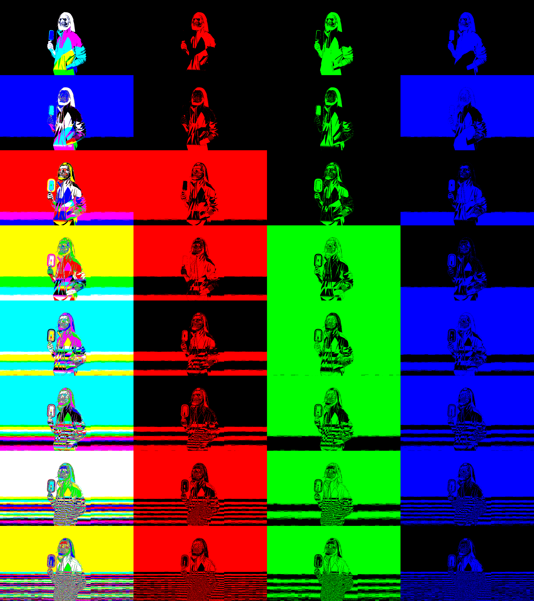

# Bitplanes

> Extracts bitplanes from all channels of an image, aiding steganalysis

## Basic Idea

Many common (home-made / hobbyist) steganography techniques involve
hiding information into the LSB of pixels sequentially etc.

This can easily, visually, be noticed by looking at the bitplanes of
the images. This repo does exactly that.

## Example

### Original Image


### Bitplanes Output



Personally, I think the top left corner gives it a very _retro_ look indeed.

## Usage

The code requires OpenCV 2.x, and CMake installed.

Compile using:

```
mkdir bin
cd bin
cmake ..
make
```

Calculate bitplanes using
```
./bitplanes <image path> <output image path>
```

## License

[MIT License](https://jay.mit-license.org/2017)
